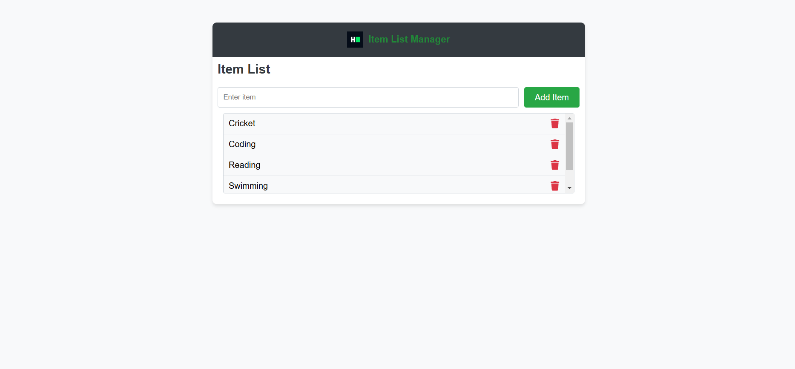

# Item List Manager

A simple React application to manage a list of items. Users can add new items to the list via an input field and a button. The application displays the list of added items dynamically.

---

## Features
1. Add Items: Users can input text and click the "Add Item" button to add items to the list.
2. Delete Items: Each item has a delete button represented by a trash icon. Users can click it to remove the corresponding item from the list.
3. Scrollable List: The list has a scrollable area to handle multiple items efficiently.
4. Branding: Includes the HackerRank logo in the header.

---

## Prerequisites
Ensure you have the following installed on your system:
1. [Node.js](https://nodejs.org/) (Recommended: v14 or above)
2. [npm](https://www.npmjs.com/) or [yarn](https://yarnpkg.com/).

---

## How to Install and Run the Application

1. Clone this repository:
   ```bash
   git clone <repository_url>

1. Navigate to the project directory:
   ```bash
   cd item-list-manager

3. Install dependencies:
   ```bash
    npm install

4. Start the development server:  
   ```bash 
    npm start

5. Open the application in your browser: Navigate to http://localhost:3000 if it doesn't open automatically. 


## Usage
1. Adding an Item:
  - Type the item name into the input field.
  - Click the "Add Item" button.
  - The item will appear in the list below the input field.

2. Prevent Empty Items:
   - Clicking the "Add Item" button without entering text will not add an item to the list.

3. Deleting Items:
   - Click the trash icon on the right of an item.
   - The item will be removed from the list.   

## UI Overview
  - Header : Displays the application title and the HackerRank logo.
  - Input Field & Button: Allows users to add new items to the list.
  - List: Dynamically updates with added items.

## Screenshots
 ### Application UI:
  
